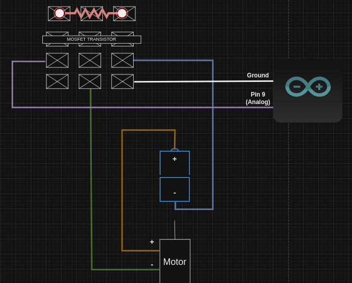

# Wiring Setup

Powerful electromagnets run hot and are expensive. A good way to get started quickly is to use a small motor with some tape attached. You can test your code hundreads of times without worrying about breaking an expensive electromagnet.

## Materials Required

* [Arduino Uno R3](https://store.arduino.cc/products/arduino-uno-rev3) (Any with pwm will work)
* [Arduino IDE](https://www.arduino.cc/en/software)
* [USB Arduino Coms cable](https://store.arduino.cc/collections/cables-wires/products/usb-2-0-cable-type-ab)
* [MOSFET Transistor](https://www.mouser.com/datasheet/2/149/FQP13N10L-107848.pdf) (Any MOSFET with similar specs will work)
* Breadboard
* Jumper Wires(~5x male to female & ~5x female to female)
* Alligator Clips (2x)
* Power supply cable (12v 10A 120W 100V~240V AC to DC )
* DC motor (12v)

## Setup

In this case our motor is replacing the electromagnet for development purposes. However, the goal is to be able to communicate with our 'electromagnet' and be able to vary the strength of the electromagnet. By changing the power of the electromagnet we achieve the pulsating effect of the ferrofluid seen [here](https://www.youtube.com/watch?v=FKUgnO14eJ4).

We can simulate giving the electromagnet less power through a technique called pwm(link me) instead of getting dedicated circuitry.

PWM stands for Pulse Width Modulation. If we send a constant stream of power to our motor it will run at full power. However, if our power stream pulsates between on and off, depending on the rate, we can make our device run at a lesser power. Moreover, by fine tunning the on and off rate we can have further control of at what percentage of speed/strength the device runs at.

The first step is to setup wirings to connect our motor, MOSFET Transistor, and Arduino.

We explore why a MOSFET and not a Relay in the FAQ below.

### Wiring

Diagram of schematics



**Image of schematics**

The project uses only one large magnet, however if you would like to use multiple magnets the wiring below also works since a terminal block is used to distribute power.

Make sure to put some tape on the motor so you can see if its moving. 	

## Progamming the Arduino

**Hello World Program**

```
void setup() {
  // put your setup code here, to run once:
  Serial.begin(9600);
}

void loop() {
  // put your main code here, to run repeatedly:
  Serial.println("Hello World!");
  delay(1000);
}
```

**
    Source: https://arduinogetstarted.com/tutorials/arduino-hello-world
**

**Test Wiring**

A simple program that runs the motor at full power for 5 seconds. I recommend saving this program to test circuitry.

```
const int MAGNET_1 = 9;


void setup() {
   pinMode(MAGNET_1, OUTPUT);
}

void loop() {
	run_for_5s();
 	exit(0);
}

void run_for_5s(){
	_run_magnet(5_000, 255);
}

void _run_magnet(int duration, int max_pwm){
  static int ts = millis();
  analogWrite(MAGNET_1, max_pwm);
  
   while(millis() - ts < duration ){
   //do nothing 
   }

  analogWrite(MAGNET_1, 0);

}
```

## FAQs

Post to the discord channel any question's you may have and they'll be uploaded to the official documentation if need be.

**Why a MOSFET Transistor and Not a Relay?**

In short, MOSFETs can switch between on and off much faster than traditional relays allowing us to do actual pwm.       Also because relays have an electromagnet inside they make a noticeable click every time it switches state. You can read more about the differences between Relays and MOSFET Transistors here(Link to personal page).

**I can't connect to my Arduino?**

* Make sure Arduino is not on top of  a metal surface. Restart and try again.
* Errors with the Output Device
  * **Linux Devices**
  * -Permission denied error. Need to add sudo to Dialout group and tty
  * ```
    //Add your standard user to the group "dialout'
      sudo usermod -a -G dialout your-username

    //Add your standard user to the group "tty"
      sudo usermod -a -G tty your-username

    //Logout/Login
    ```
  * -No device found error. Finding correct output. Should be /dev/ttyACM0 or /dev/ttyUSB0.
  * ```
    //Run this command to find which port
    dmesg | grep tty

    //or 
    //Remove Arduino usb plug
    ls /dev

    //Reconnect usb device
    ls /dev

    //See what new port appeared by comparing output of first command(when device wasn't plugged in) to output // of last command(when device was plugged in).  

    ```
  * **Windows**
  * Output device should be "COM1"
