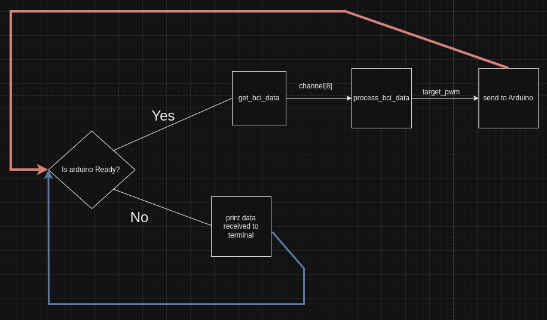
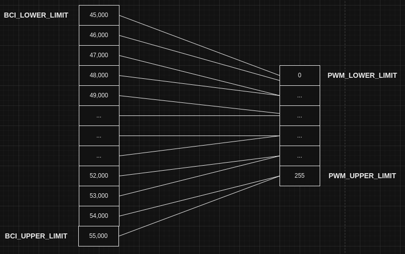

# OpenBCI Comms Explained

In the previous section we controlled the arduino with auto-generated data from a artificial OpenBCI headset.

This section will take a deeper dive at the code and explain in detail what is happening.

## Understanding the Code

OpenBCI Cyton board reads brain signals and outputs a value between -30k and 55k (the output may vary). Point is, different parts of the brain will emit values of different ranges.

### Flow Control Diagram




### Import  Libraries

```python
import serial
import time
import random
import math
import statistics

from brainflow.board_shim import BoardShim, BrainFlowInputParams, LogLevels, BoardIds
from brainflow.data_filter import DataFilter, AggOperations
```

### Set global Variables

These will help us make our code more dynamic by only making changes to these values.

```python
##Change these values depending on channel, some channels only go up to 100
BCI_UPPER_LIMIT = 55_000
BCI_LOWER_LIMIT = 45_000 #big negative numbers are considered no activity
SELECTED_CHANNEL = 8

DELAY_LOWER_LIMIT = 150
DELAY_UPPER_LIMIT = 100
DELAY_STEP = 10

PWM_LOWER_LIMIT = 20.0
PWM_UPPER_LIMIT = 40.0
#PWM_STEP = 10
```

### Sleep Timer & Data Rows

```python
SLEEP_TIMER = 3
DATA_ROWS = 80
```

When we read data off our cyton board we need to set the current thread to sleep. Our Cyton board samples at 250Htz (250 rows per second). You can lower/increase this value depending on the number of rows you want to collect.

### Handshake Signal from Arduino

```python

# Handshake signal from Arduino
def arduino_ready():
    while True:
        #print("waiting")
        if ser.in_waiting:
            response = ser.readline().decode('utf-8').rstrip()
            if response == "Ready":
                return True
            else:
                print("\n Recived->>", response)

```

 We only want to send signals to the Arduino whenever it's ready. Hence, we keep the line open and wait until it sends the code "Ready". Keep in mind that the arduino may send other kinds of data for debugging so we need this filter.

### Send Data

```python

def send_data(pwmTarget):
    ## DEBUGGING - Send a random number to the arduino
    delay = 0
    pwmTarget = randomMultiple(PWM_LOWER_LIMIT, PWM_UPPER_LIMIT, PWM_STEP)
		#send values between PWM_LOWER_LIMIT (50) and    PWM_UPPER_LIMIT (255) 
		#that are multiples of PWM_STEP (5)
		#ex: 55, 100, 75, 250, 160, ... 
  

    ##DEBUGGING - Alternate between to numbers 

    # low = 15
    # high = 50

    # if(isAtHigh):
    #     pwmTarget = low
    # else:
    #     pwmTarget = high
  
    ##DEBUGGING - Send fixed values to the arduino

    #delay = 150
    #pwm_max = 255

    # Send the values to Arduino
    ser.write(str(delay).encode('utf-8'))
    ser.write(b',')
    ser.write(str(pwmTarget).encode('utf-8'))
    ser.write(b'\n')

```

### Random Multiple

```python
def randomMultiple(minimum, maximum, step):
    return random.randint(math.ceil(minimum / step ), math.floor(maximum / step)) * step
```

We currently don't use this function since our values are being auto-generated.

### OpenBCI Connection

```python
### openBCI Connection ###

#openBCI board setup
BoardShim.enable_dev_board_logger()

# use synthetic board for demo
params = BrainFlowInputParams()
board = BoardShim(BoardIds.SYNTHETIC_BOARD.value, params)

#REAL BOARD
#params = BrainFlowInputParams()
#params.serial_port = "/dev/ttyUSB0" //CHANGE THIS DEPENDING ON YOUR OS
#board = BoardShim(BoardIds.CYTON_BOARD, params)

def get_board_data():

    board.prepare_session()
    board.start_stream()
    BoardShim.log_message(LogLevels.LEVEL_INFO.value, 'start sleeping in the main thread')
    time.sleep(SLEEP_TIMER)
    data = board.get_board_data(DATA_ROWS)
    board.stop_stream()
    board.release_session()
  

  
    eeg_channels = BoardShim.get_eeg_channels(BoardIds.CYTON_BOARD.value)
  
    downsampled_data = []

    # downsample data, it just aggregates data
    for count, channel in enumerate(eeg_channels):
        print('Original data for channel %d:' % channel)
        print(data[channel])
        # if count == 0:
        #     downsampled_channel = DataFilter.perform_downsampling(data[channel], 3, AggOperations.MEDIAN.value)
        # elif count == 1:
        #     downsampled_channel = DataFilter.perform_downsampling(data[channel], 2, AggOperations.MEAN.value)
        # else:
        #     downsampled_channel = DataFilter.perform_downsampling(data[channel], 2, AggOperations.EACH.value)
  
        #print('Downsampled data for channel %d:' % channel)
        #print(downsampled_data)

        # downsampled_data.append(downsampled_channel)

    return data[SELECTED_CHANNEL]
```

We setup our board, sleep for 3 seconds (SLEEP_TIMER) seconds, then collect our data from the board object, and then return data from channel number 8 (SELECTED_CHANNEL).

Optionally you can downsample the incoming data, however the code is commented out.

### Converting OpenBCI range to PWM Range



We are still using auto-generated data, however our goal is to transform the range of values that the OpenBCI board may give and map it to values from 0 to 255, which represent the strength our motor will run at. Remember that we are still using the motor and not the electromagnet for rapid testing.

```python

def process_bci_data(channel):
  
    mean =  statistics.mean(channel) 

    if (mean < 0 ):
        return PWM_LOWER_LIMIT


    diff = (BCI_UPPER_LIMIT - BCI_LOWER_LIMIT)
    x = mean - BCI_LOWER_LIMIT

    x_normalized = (x/diff)

    #DEBUGGING
    #print("\n channel: \n", channel, "\n")
    #print("\n mean: ", mean, "\n")
    #print("\n x_nomalized:", x_normalized, "\n")

  
    return (x_normalized *  (PWM_UPPER_LIMIT - PWM_LOWER_LIMIT) ) + PWM_LOWER_LIMIT 
```

To convert the given auto-generated(values from -33k-55k) data to a value between 0(PWM_LOWER_LIMIT)TO 255(PWM_UPPER_LIMIT), we determine the mean for that section.

We convert the mean into a decimal value that is represenative of what percentage of the BCI_LOWER_LIMIT to BCI_UPPER_LIMIT range we set before hand. Afterwards, we use that percentage in the PWM_LOWER_LIMIT to PWM_UPPER_LIMIT range.

### Set up Serial Connection

```python
# Set up the serial connection
ser = serial.Serial('/dev/ttyACM0', 9600, timeout=1)  # Change '/dev/ttyACM0' to the correct port for your Arduino
ser.reset_input_buffer()
ser.close()
ser.open()
time.sleep(5)
```

Make sure to change the 'ser' variable depending on your system. To figure out what this should be click here(link me).

We wait 5 seconds before starting the program. This will give some time for our motor to start running.

### Putting It Together

```python
def get_pwm_value():
    #Collect data from bci headset

    channel_data = get_board_data()
    return process_bci_data(channel_data)

def main():
   
    while True:
        try:
            # Wait for Arduino confirmation
            if arduino_ready():
                print("Arduino Ready")
                send_data(get_pwm_value())
            else:
                #print("Waiting")

        except KeyboardInterrupt:
            break

    # Close the serial connection
    ser.close()
main()
```
